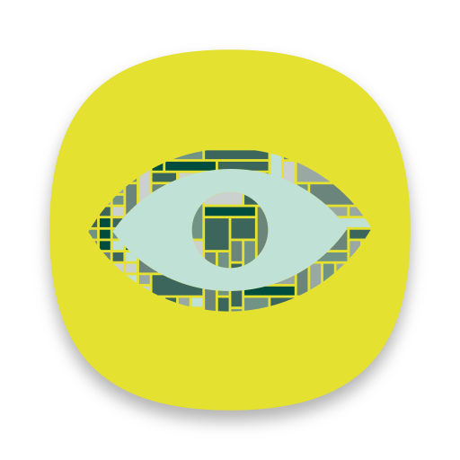
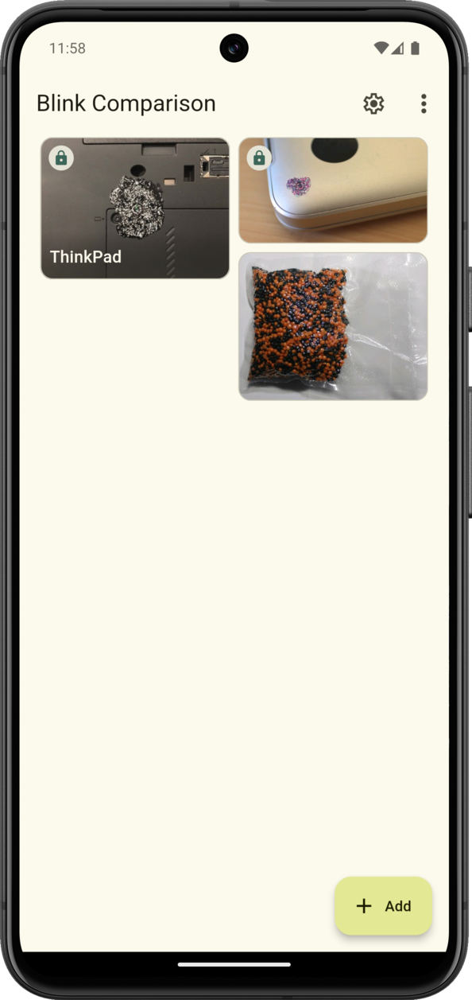
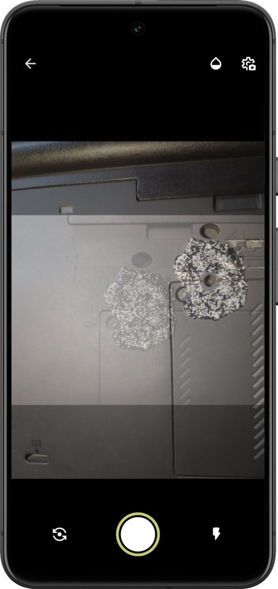
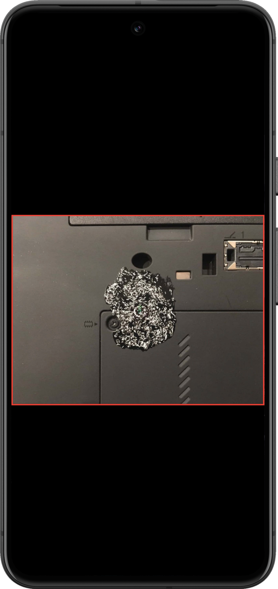
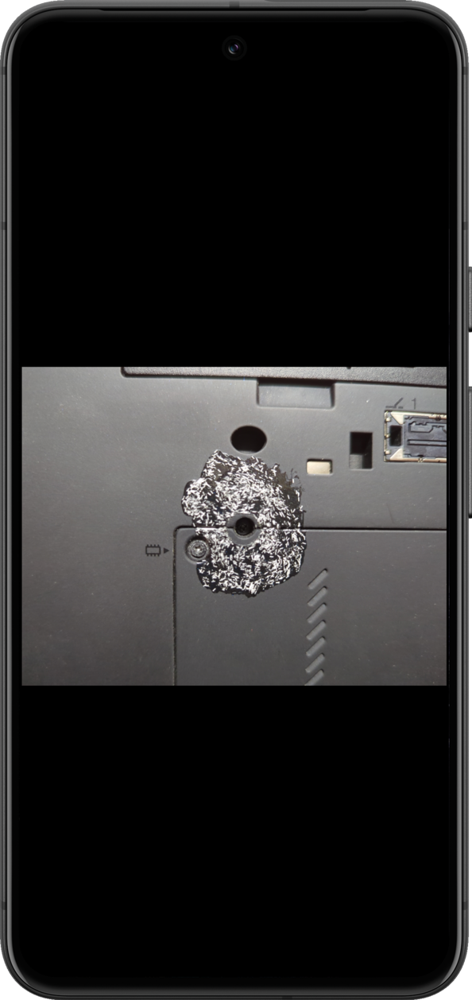

<h2><b>Blink Comparison</b></h2>
<h4>Simplifies comparing photos of tamper-evident seals and patterns using your eyes.</h4>

----

## Screenshots

## Description

The concept of "blink comparison" method is simple - the app allows you to quickly switch pictures without delay so you can see the differences.

"Blink comparison" ([Wikipedia](https://en.wikipedia.org/wiki/Blink_comparator)) method uses high efficiency pattern recognition by human eyes, to permit quick verification between a reference picture and an actual one being taken on the spot. For example, in the goal of detecting tampering in high contrast nail polish tamper-evident seals.

Relative documentation on the tamper-evident glitter nail polish seals concept and why it is hard to beat:
 - https://trmm.net/Glitter/
 - https://www.wired.com/2013/12/better-data-security-nail-polish/

[Use, see, change and share](https://en.wikipedia.org/wiki/Free_software); [with all](https://en.wikipedia.org/wiki/Copyleft).

## 📋 Features

 - Free and Open Source software (FOSS)
 - Support for various platforms and devices (currently Android only)
 - Add and store reference pictures in the app or take a photo on the spot; all pictures are encrypted, making it harder to steal or replacement
 - Compare a reference image with the one just taken using "blink comparison" method
 - Helps to take a compared photo in the correct position, at the correct angle, lighting and distance
 - Material Design
 - Night theme
 - Responsive UI for different devices form factors

## 🔒 Security

All reference images that added to the app stored as encrypted, making it harder to steal or replacement. Currently, [password-based encryption](http://www.crypto-it.net/eng/theory/pbe.html) (PBE) is used. It's based on the [XChaCha20Poly1305](https://www.cryptopp.com/wiki/XChaCha20Poly1305) scheme and using a key derived by [Argon2](https://en.wikipedia.org/wiki/Argon2) function "on the fly" (during the encryption/decryption itself). The password is stored in the app as a hash obtained with Argon2.

## 🖥️💻📱 Available platforms

 - Android
 - ~~iOS~~ (planned)
 - ~~Linux~~ (planned)

 ## 🌍 Translations

 - **English**
 - **Russian**

## 💰 Donation

If you like Blink Comparison you can support developer with these methods. If you have problems with payment or you want to donate in another way, contact me: `proninyaroslav@mail.ru`. Thank you!

 - **PayPal**: 
 - **Yandex Money (YooMoney)**: `410011738561939`
 - **WebMoney**:
     - **WMZ**: `Z335461926163`
     - **WMR**: `R151579576467`
 - **Amazon.com eGift Cards**: just choose your amount and type e-mail `proninyaroslav@mail.ru`
in the gift card details https://smile.amazon.com/gp/product/B004LLIKVU/
 - **Liberapay**: 
 - **Bitcoin**: `1Af9DgxtWvVp6bFiYQw2MeWtRzTXshRYpB`
 - **Nano**: `nano_1b13t35x5dwu39xcs3xj4ozfsniozfnxdqwjijy6efnkda6sc3hqie914fja`

## ⚙️ Building

Please see [BUILD.md](BUILD.md)

## 🎉 Contributing

Please see [CONTRIBUTING.md](CONTRIBUTING.md)

#### Developers

* [Yaroslav Pronin](https://github.com/proninyaroslav)

#### Logo

* [Ramy (@rshirwan)](https://t.me/rshirwan)

## 🔒 Privacy Policy

Please see our [Privacy Policy](PRIVACY.md).

## 📄 License

    Copyright (C) 2022 Yaroslav Pronin <proninyaroslav@mail.ru>
    This file is part of Blink Comparison.
    Blink Comparison is free software: you can redistribute it and/or modify
    it under the terms of the GNU General Public License as published by
    the Free Software Foundation, either version 3 of the License, or
    (at your option) any later version.
    This program is distributed in the hope that it will be useful,
    but WITHOUT ANY WARRANTY; without even the implied warranty of
    MERCHANTABILITY or FITNESS FOR A PARTICULAR PURPOSE.  See the
    GNU General Public License for more details.
    You should have received a copy of the GNU General Public License
    along with this program.  If not, see <http://www.gnu.org/licenses/>.
